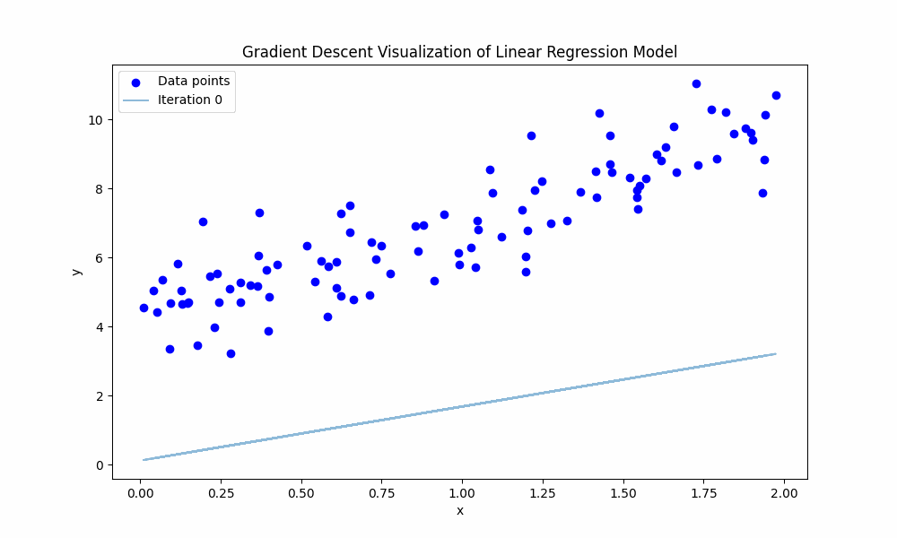

### 线性回归

#### 1. 模型假设
线性回归假设自变量 $x$ 和因变量 $y$ 之间存在线性关系。模型表示为：

$$ 
y = \beta_0 + \beta_1 x_1 + \beta_2 x_2 + \cdots + \beta_n x_n + \epsilon 
$$

其中：
- $y$ 是因变量（目标变量）。
- $x_1, x_2, \ldots, x_n$ 是自变量（特征）。
- $\beta_0$ 是截距。
- $\beta_1, \beta_2, \ldots, \beta_n$ 是回归系数。
- $\epsilon$ 是误差项，假设其均值为零且服从正态分布。

#### 2. 目标
线性回归的目标是找到最优的回归系数 $\beta$，以最小化预测值与实际值之间的平方差之和。

#### 3. 问题求解

#### 3.1 解析解

我们有一个线性回归模型：

$$
y = \beta_0 + \beta_1 x_1 + \beta_2 x_2 + \cdots + \beta_n x_n + \epsilon
$$

我们的目标是找到参数 $\beta = [\beta_0, \beta_1, \cdots, \beta_n]$，以最小化预测值与实际值之间的平方误差之和。

$$
\beta = [\beta_0, \beta_1, \cdots, \beta_n]
$$

问题可以用矩阵形式表示为：

$$
\mathbf{y} = \mathbf{X} \boldsymbol{\beta} + \boldsymbol{\epsilon}
$$

其中： 
- $\mathbf{y}$ 是 $m \times 1$ 的目标变量向量。
- $\mathbf{X}$ 是 $m \times (n+1)$ 的矩阵，第一列全为1（对应截距 $\beta_0$），其余列为特征值。
- $\boldsymbol{\beta}$ 是 $(n+1) \times 1$ 的回归系数向量。
- $\boldsymbol{\epsilon}$ 是 $m \times 1$ 的误差向量。

**目标函数**  

我们旨在最小化平方误差之和：  
原始目标函数可以定义为：

$$
S = \sum_{i=1}^{m} (y_i - \hat{y}_i)^2
$$

其中 $y_i$ 是实际值，$\hat{y}_i$ 是预测值。

$$
S = (\mathbf{y} - \mathbf{X} \boldsymbol{\beta})^T (\mathbf{y} - \mathbf{X} \boldsymbol{\beta})
$$

展开表达式，我们得到：

$$
S = (\mathbf{y}^T - \boldsymbol{\beta}^T \mathbf{X}^T)(\mathbf{y} - \mathbf{X} \boldsymbol{\beta})
$$

$$
S = \mathbf{y}^T \mathbf{y} - \mathbf{y}^T \mathbf{X} \boldsymbol{\beta} - \boldsymbol{\beta}^T \mathbf{X}^T \mathbf{y} + \boldsymbol{\beta}^T \mathbf{X}^T \mathbf{X} \boldsymbol{\beta}
$$

由于 $\mathbf{y}^T \mathbf{X} \boldsymbol{\beta}$ 和 $\boldsymbol{\beta}^T \mathbf{X}^T \mathbf{y}$ 是标量且相等，我们可以简化为：

$$
S = \mathbf{y}^T \mathbf{y} - 2\mathbf{y}^T \mathbf{X} \boldsymbol{\beta} + \boldsymbol{\beta}^T \mathbf{X}^T \mathbf{X} \boldsymbol{\beta}
$$

**推导步骤**
1. 展开目标函数：

$$
S = \mathbf{y}^T \mathbf{y} - 2\mathbf{y}^T \mathbf{X} \boldsymbol{\beta} + \boldsymbol{\beta}^T \mathbf{X}^T \mathbf{X} \boldsymbol{\beta}
$$

2. 对 $\boldsymbol{\beta}$ 求导并设为零：

为了找到最优的 $\boldsymbol{\beta}$，我们需要对目标函数 $S$ 关于 $\boldsymbol{\beta}$ 求导并设为零。$S$ 关于 $\boldsymbol{\beta}$ 的导数为：

$$
\frac{\partial S}{\partial \boldsymbol{\beta}} = \frac{\partial}{\partial \boldsymbol{\beta}} \left( \mathbf{y}^T \mathbf{y} - 2\mathbf{y}^T \mathbf{X} \boldsymbol{\beta} + \boldsymbol{\beta}^T \mathbf{X}^T \mathbf{X} \boldsymbol{\beta} \right)
$$

- 由于 $\mathbf{y}^T \mathbf{y}$ 是关于 $\boldsymbol{\beta}$ 的常数，其导数为零。

- $-2\mathbf{y}^T \mathbf{X} \boldsymbol{\beta}$ 关于 $\boldsymbol{\beta}$ 的导数为 $-2\mathbf{X}^T \mathbf{y}$，因为 $\mathbf{y}^T \mathbf{X}$ 是常数矩阵，线性项 $\mathbf{X} \boldsymbol{\beta}$ 关于 $\boldsymbol{\beta}$ 的导数为 $\mathbf{X}$。因此，标量因子 $-2$ 保留，结果为 $-2\mathbf{X}^T \mathbf{y}$。

- 二次型的导数：对于二次型 $\boldsymbol{\beta}^T A \boldsymbol{\beta}$，关于 $\boldsymbol{\beta}$ 的导数为：

$$
\frac{\partial}{\partial \boldsymbol{\beta}} (\boldsymbol{\beta}^T A \boldsymbol{\beta}) = (A + A^T) \boldsymbol{\beta}
$$

由于 $A = \mathbf{X}^T \mathbf{X}$ 是对称的（$A = A^T$），导数简化为：

$$
2A\boldsymbol{\beta} = 2\mathbf{X}^T \mathbf{X} \boldsymbol{\beta}
$$

因此，我们有：

$$
\frac{\partial S}{\partial \boldsymbol{\beta}} = -2\mathbf{X}^T \mathbf{y} + 2\mathbf{X}^T \mathbf{X} \boldsymbol{\beta}
$$

设导数为零，我们得到：

$$
-2\mathbf{X}^T \mathbf{y} + 2\mathbf{X}^T \mathbf{X} \boldsymbol{\beta} = 0
$$

3. 求解 $\boldsymbol{\beta}$：

$$
\mathbf{X}^T \mathbf{X} \boldsymbol{\beta} = \mathbf{X}^T \mathbf{y}
$$

假设 $\mathbf{X}^T \mathbf{X}$ 是可逆的，我们可以求解 $\boldsymbol{\beta}$：

$$
\boldsymbol{\beta} = (\mathbf{X}^T \mathbf{X})^{-1} \mathbf{X}^T \mathbf{y}
$$

```python
import numpy as np

def linear_regression_weights(X, y):
    """
    计算线性回归模型的权重的解析解。
    """
    # 计算 X 的转置
    X_transpose = np.transpose(X)
    
    # 计算 X_transpose 和 X 的点积
    X_transpose_X = np.dot(X_transpose, X)
    
    # 计算 X_transpose_X 的逆
    X_transpose_X_inv = np.linalg.inv(X_transpose_X)
    
    # 计算 X_transpose 和 y 的点积
    X_transpose_y = np.dot(X_transpose, y)
    
    # 计算权重
    weights = np.dot(X_transpose_X_inv, X_transpose_y)
    
    return weights

# 使用示例
X = np.array([[1, 1, 1], [1, 2, 4], [1, 3, 9], [1, 4, 16]])
y = np.array([[1], [2], [3], [4]])
weights = linear_regression_weights(X, y)
print(weights)
```
    [[-1.42108547e-14]
    [ 1.00000000e+00]
    [ 7.10542736e-15]]

#### 3.2 梯度下降

梯度下降是一种迭代优化算法，用于最小化代价函数。

为了更好地理解梯度下降的过程，我们可以通过一个动画来可视化线性回归模型的梯度下降过程。以下是一个生成的 gif 图，展示了梯度下降的迭代过程：




对于线性回归，代价函数定义为：

$$
S = \frac{1}{2m} \sum_{i=1}^{m} (y_i - \hat{y}_i)^2
$$

其中 $m$ 是训练样本的数量，$y_i$ 是实际值，$\hat{y}_i$ 是预测值。

目标是找到使代价函数 $S$ 最小化的权重 $\boldsymbol{\beta}$。梯度下降算法使用以下规则迭代更新权重：

$$
\boldsymbol{\beta} := \boldsymbol{\beta} - \alpha \frac{\partial S}{\partial \boldsymbol{\beta}}
$$

其中 $\alpha$ 是学习率。

为了推导更新规则，我们首先需要计算代价函数关于权重 $\boldsymbol{\beta}$ 的梯度：

$$
\frac{\partial S}{\partial \boldsymbol{\beta}} = \frac{\partial}{\partial \boldsymbol{\beta}} \left( \frac{1}{2m} \sum_{i=1}^{m} (y_i - \hat{y}_i)^2 \right)
$$

将 $\hat{y}_i$ 展开为 $\mathbf{X} \boldsymbol{\beta}$：

$$
\frac{\partial S}{\partial \boldsymbol{\beta}} = \frac{\partial}{\partial \boldsymbol{\beta}} \left( \frac{1}{2m} \sum_{i=1}^{m} (y_i - \mathbf{X}_i \boldsymbol{\beta})^2 \right)
$$

使用链式法则，我们得到：

$$
\frac{\partial S}{\partial \boldsymbol{\beta}} = \frac{1}{m} \sum_{i=1}^{m} (y_i - \mathbf{X}_i \boldsymbol{\beta})(- \mathbf{X}_i)
$$

简化后，我们得到：

$$
\frac{\partial S}{\partial \boldsymbol{\beta}} = -\frac{1}{m} \mathbf{X}^T (\mathbf{y} - \mathbf{X} \boldsymbol{\beta})
$$

因此，梯度下降更新规则变为：

$$
\boldsymbol{\beta} := \boldsymbol{\beta} + \alpha \frac{1}{m} \mathbf{X}^T (\mathbf{y} - \mathbf{X} \boldsymbol{\beta})
$$

这个更新规则被迭代应用，直到代价函数收敛到最小值。

```python
import numpy as np

def gradient_descent(X, y, alpha=0.01, iterations=1000):
    """
    使用梯度下降拟合线性回归模型
    """
    m, n = X.shape
    beta = np.zeros((n, 1))
    
    for _ in range(iterations):
        gradient = (1/m) * np.dot(X.T, y - np.dot(X, beta))
        beta = beta + alpha * gradient
    
    return beta

# 使用示例
X = np.array([[1, 1, 1], [1, 2, 4], [1, 3, 9], [1, 4, 16]])
y = np.array([[1], [2], [3], [4]])
alpha = 0.005
iterations = 100000
beta = gradient_descent(X, y, alpha, iterations)
print(beta)
```
    [[6.94127936e-05]
    [9.99936851e-01]
    [1.19586769e-05]]

#### 参考文献
- https://zh.d2l.ai/chapter_linear-networks/linear-regression.html